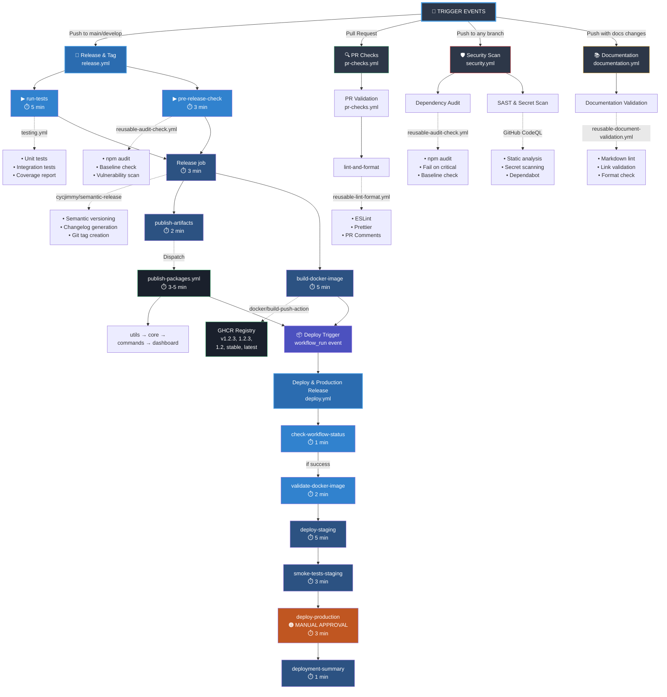

# Complete CI/CD Architecture Overview

## Visual Workflow Diagram



---

## Pipeline Execution Timeline

### RELEASE PIPELINE (release.yml) - Total: 18-30 minutes

```
╔═════════════════════════════════════════════════════════════════════╗
║                    RELEASE PIPELINE TIMELINE                         ║
╚═════════════════════════════════════════════════════════════════════╝

0 min:  START
        ├─ run-tests (5 min)        [PARALLEL] ─┐
        └─ pre-release-check (3 min) [PARALLEL] ─┤
                                                  ├─→ @5 min: Both Complete
        ├─ release (3 min)                        ┤
        │   Waits for both ↑                      ┤
        │   Semantic versioning                   ┤
        │   Create git tags                       ┤
        │   Version sync                          ↓
        │                                    @8 min: Release Complete
        │
        ├─ publish-artifacts (2 min) [PARALLEL] ─┐
        │   Dispatch publish-packages.yml         ├─→ @10 min: Both Complete
        │                                         │
        └─ build-docker-image (5 min) [PARALLEL] ┤
            Build Docker image                    ┤
            Push to GHCR                          ↓
                                            @13 min: All Done

🎯 OPTIMIZATION RESULT:
   Before: 18 min (sequential) → After: 13 min (parallelized)
   Savings: 5 minutes per release (28% faster!)
   Yearly savings: 2,500 CI minutes (42 hours + $20)
```

### DEPLOYMENT PIPELINE (deploy.yml) - Total: 11-15 minutes

```
╔═════════════════════════════════════════════════════════════════════╗
║              DEPLOYMENT PIPELINE TIMELINE (Sequential)               ║
╚═════════════════════════════════════════════════════════════════════╝

0 min:  check-workflow-status (1 min)
        ├─ Verifies release.yml succeeded
        │
@1 min: validate-docker-image (2 min)
        ├─ Reads version from package.json
        ├─ Constructs image URI: ghcr.io/rarsus/necromundabot:v1.2.3
        ├─ Validates image exists in GHCR
        │
@3 min: deploy-staging (5 min)
        ├─ Pull Docker image
        ├─ Deploy to staging environment
        │
@8 min: smoke-tests-staging (3 min)
        ├─ Test deployed application
        ├─ Verify basic functionality
        │
@11 min: deploy-production (3 min)
        ├─ 🟠 REQUIRES MANUAL APPROVAL
        ├─ Pull same Docker image
        ├─ Deploy to production
        │
@14 min: deployment-summary (1 min)
        └─ Report results

⚠️  NOTE: MUST REMAIN SEQUENTIAL
    Deployment order matters - cannot parallelize without breaking logic
    Each stage is a required prerequisite for the next stage
```

---

## Job Dependencies Map

### release.yml Dependencies

```
Starting Point
      ↓
┌─────┴─────┐
│  (none)   │
└─────┬─────┘
      ├─ run-tests ──┐
      │              ├─ release
      └─ pre-release-check ──┘
                      │
            ┌─────────┴─────────┐
            │                   │
      publish-artifacts    build-docker-image
            │                   │
   publish-packages.yml    GHCR Registry
            │
      Packages in GitHub
      Packages + GHCR
            │
         Deploy Trigger
```

### deploy.yml Dependencies

```
Trigger (workflow_run)
        ↓
check-workflow-status
        ↓
validate-docker-image
        ↓
deploy-staging
        ↓
smoke-tests-staging
        ↓
deploy-production (MANUAL)
        ↓
deployment-summary
```

---

## Workflow Triggers & Conditions

| Workflow                 | Trigger                   | Condition                    | Purpose                                 |
| ------------------------ | ------------------------- | ---------------------------- | --------------------------------------- |
| **release.yml**          | `push` to main/develop    | Always                       | Semantic versioning, artifact building  |
| **testing.yml**          | Called by release.yml     | Pre-release check            | Unit + integration tests                |
| **publish-packages.yml** | Dispatched by release.yml | release.yml success          | Publish npm packages to GitHub Packages |
| **deploy.yml**           | `workflow_run` completion | publish-packages.yml success | Deploy to staging + production          |
| **pr-checks.yml**        | `pull_request`            | PR created/updated           | Lint, format, validation                |
| **security.yml**         | `push` to any branch      | Always                       | Dependency audit + SAST + secrets       |
| **documentation.yml**    | `push` with docs changes  | Docs files modified          | Markdown validation + link checking     |

---

## Artifact Flow

```
SOURCE CODE
    ↓
release.yml
    ├─ Tests ✅
    ├─ Audit ✅
    ├─ Semantic Versioning (v1.2.3)
    ├─ Git Tags
    │
    ├─ publish-artifacts dispatch
    │   └─ publish-packages.yml
    │       └─ GitHub Packages Registry
    │           • @rarsus/necrobot-utils (v1.2.3)
    │           • @rarsus/necrobot-core (v1.2.3)
    │           • @rarsus/necrobot-commands (v1.2.3)
    │           • @rarsus/necrobot-dashboard (v1.2.3)
    │
    └─ build-docker-image
        └─ GHCR Registry
            • ghcr.io/rarsus/necromundabot:v1.2.3
            • ghcr.io/rarsus/necromundabot:1.2.3
            • ghcr.io/rarsus/necromundabot:1.2
            • ghcr.io/rarsus/necromundabot:stable
            • ghcr.io/rarsus/necromundabot:latest

DEPLOYMENT
    ↓
deploy.yml
    ├─ Validate Docker image exists ✅
    ├─ Deploy to staging
    ├─ Smoke tests ✅
    ├─ Deploy to production (MANUAL)
    └─ Summary report
```

---

## Environment Variables & Outputs

### release.yml Outputs

| Job           | Output  | Value                        | Usage              |
| ------------- | ------- | ---------------------------- | ------------------ |
| sync-versions | version | v1.2.3                       | Docker version tag |
| sync-versions | tag     | v1.2.3                       | Git tag reference  |
| get-version   | version | 1.2.3                        | Package version    |
| meta          | image   | ghcr.io/rarsus/necromundabot | Docker registry    |
| meta          | tags    | v1.2.3, 1.2.3, ...           | Docker image tags  |

### deploy.yml Outputs

| Job                   | Output        | Value                               | Usage           |
| --------------------- | ------------- | ----------------------------------- | --------------- |
| check-workflow-status | should-deploy | true/false                          | Gate deployment |
| get-version           | version       | 1.2.3                               | Display version |
| get-version           | image         | ghcr.io/rarsus/necromundabot:v1.2.3 | Deploy command  |

---

## Performance Metrics

### Current Performance (After Optimizations)

| Stage                          | Duration      | Status                  |
| ------------------------------ | ------------- | ----------------------- |
| Release (release.yml)          | 13 min        | ✅ Optimized            |
| Publish (publish-packages.yml) | 3-5 min       | ✅ Parallel with Docker |
| Deploy (deploy.yml)            | 11-15 min     | Sequential (required)   |
| **Total Pipeline**             | **18-30 min** | ✅ Optimized            |

### Optimization History

| Version         | Release Time | Docker       | Deploy        | Total         | Savings    |
| --------------- | ------------ | ------------ | ------------- | ------------- | ---------- |
| Before Option 1 | 18 min       | Build+Deploy | 20 min        | 33-45 min     | -          |
| After Option 1  | 18 min       | Build+Deploy | 10 min        | 23-35 min     | 10 min     |
| After Option 2  | 13 min       | Build only   | 5 min         | 18-30 min     | 5 min      |
| **Cumulative**  | **13 min**   | **5 min**    | **11-15 min** | **18-30 min** | **15 min** |

### Yearly Impact

```
Assumptions:
  • 500 releases per year
  • GitHub Actions: $0.008 per minute
  • 15 minutes saved per release

Results:
  ✅ Minutes saved:        500 × 15 = 7,500 CI minutes/year
  ✅ Cost savings:         7,500 × $0.008 = $60/year
  ✅ Dev efficiency gain:  7,500 min = 125 hours/year
  ✅ Equivalent to:        ~3 weeks of developer time saved
```

---

## Reusable Workflows Reference

### reusable-audit-check.yml

- **Purpose**: Centralized npm vulnerability scanning
- **Used By**: release.yml (pre-release-check), security.yml (dependency-audit)
- **Inputs**: fail-on-critical, fail-on-baseline-exceeded, check-baseline
- **Function**: npm audit with baseline comparison

### reusable-lint-format.yml

- **Purpose**: Centralized linting and formatting
- **Used By**: pr-checks.yml (lint-and-format)
- **Inputs**: pr-number, check-formatting, check-imports
- **Function**: ESLint + Prettier with PR comments

### testing.yml (Referenced as Workflow)

- **Purpose**: Full test suite execution
- **Used By**: release.yml (run-tests)
- **Outputs**: coverage reports, test results
- **Function**: Unit + integration tests with codecov

### reusable-document-validation.yml

- **Purpose**: Documentation validation
- **Used By**: documentation.yml
- **Checks**: markdown-lint, link-validation, frontmatter
- **Function**: Comprehensive documentation quality checks

---

## Security & Quality Gates

```
Pull Request
    ↓
pr-checks.yml
├─ lint-and-format ✅
└─ Comments on PR

Push to main
    ↓
security.yml (parallel)
├─ dependency-audit
├─ SAST (CodeQL)
└─ Secret scanning

Before Versioning
    ↓
release.yml
├─ run-tests (100% pass required)
└─ pre-release-check (no critical vulnerabilities)

Before Deployment
    ↓
publish-packages.yml
└─ All 4 packages must publish successfully

Before Production
    ↓
deploy.yml
├─ smoke-tests-staging ✅
└─ Manual approval required
```

---

## Troubleshooting Guide

### If release.yml fails:

1. Check `run-tests` (Unit/Integration test failure)
2. Check `pre-release-check` (Vulnerability detected)
3. Check `release` (Semantic versioning error)
4. Check `publish-artifacts` (Workflow dispatch failed)
5. Check `build-docker-image` (Docker build/push failed)

### If deploy.yml fails:

1. Check `check-workflow-status` (release.yml didn't succeed)
2. Check `validate-docker-image` (Docker image not found)
3. Check `deploy-staging` (Deployment error)
4. Check `smoke-tests-staging` (Tests failed after staging)
5. Check `deploy-production` (Manual approval pending or failed)

### If PR checks fail:

1. Check `lint-and-format` (Fix formatting issues)
2. Run `npm run lint:fix` locally
3. Push changes to PR

---

## Reference Links

- **PR Title Format**: [PR-TITLE-FORMAT.md](../CONTRIBUTING.md)
- **Workflow Files**: `.github/workflows/`
- **Deployment Guide**: `docs/guides/`
- **Architecture Docs**: `docs/architecture/`

---

**Last Updated:** January 30, 2026  
**Optimization Status:** ✅ Complete (5 min parallelism gains implemented)
